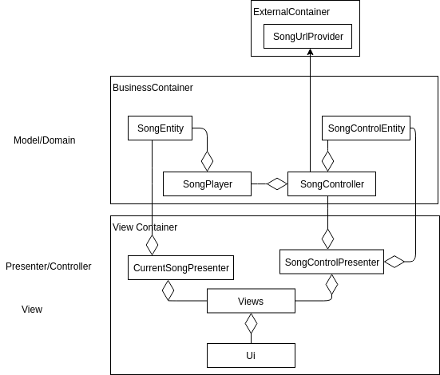

# Epsilon Onboard Media Player

This program is the onboard media control for the University of Calgary's Solar Car Schulich Elysia. This program is a music player which runs on the car's secondary Raspberry Pi on the center display.

## Playing Music

The media player will search for songs in the `/home/{user}/Music/SongLibrary` folder. Currently the media player will only decode files of the `.mp3`format. 

## Class Diagram

## Download All Song
1. Installing AWSCLI
In order to download all song, first you need to install AWSCLI by running:
`sudo apt-get install awscli`

2. Obtaining Access Keys
To directly download from the aws bucket, you will need to obtain the Access Key ID and the Secret Access Key.

3. Downloading all songs
With the access keys, you can now run `./DownloadAllSong.sh` and inputting the access keys into the appropriate places. The region name is `us-west-2`.
